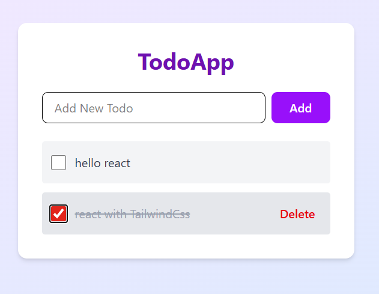
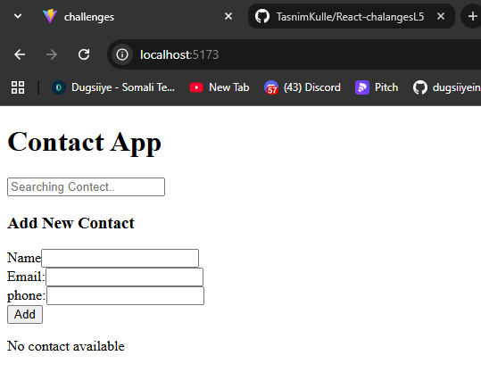
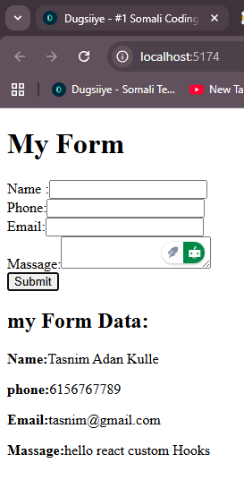
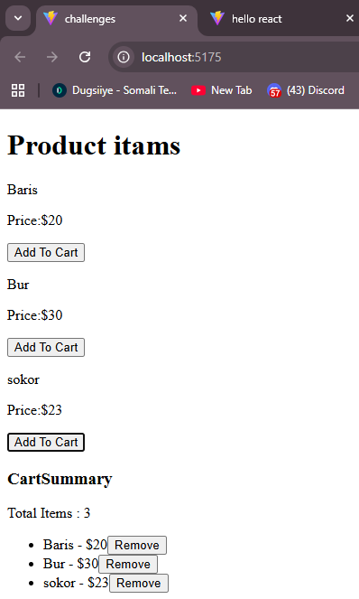
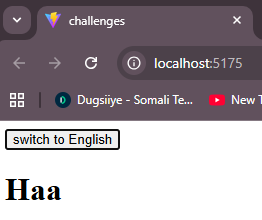

# React + Challenges
- # Challage 20📝 TodoApp (React + Tailwind CSS)

A simple Todo application built with **React** and styled using **Tailwind CSS**.  
It allows you to add tasks, mark them as completed, and delete them easily.

---
🔗 **View Source Code:**  
- [TodoApp.jsx](https://github.com/TasnimKulle/React-chalangesL5/blob/main/src/TodoApp.jsx)

## 🚀 Features
- Add new todos
- Mark todos as completed
- Delete todos
- Clean UI with Tailwind CSS
---
- 
  

# Challange Eighteen📱 ContactApp

- A simple React contact management app built with useReducer and useState,You can add, edit, delete, favorite, and search contacts easily.
  
🔗 **View Source Code:**  
- [reducer.js](https://github.com/TasnimKulle/React-chalangesL5/blob/main/src/reducer.jsx)
- [ContectApp.jsx](https://github.com/TasnimKulle/React-chalangesL5/blob/main/src/ContectApp.jsx)
- [contectForm.jsx](https://github.com/TasnimKulle/React-chalangesL5/blob/main/src/ContectForm.jsx)
- [contactList.jsx](https://github.com/TasnimKulle/React-chalangesL5/blob/main/src/ContactList.jsx)
- [ContactItemjsx](https://github.com/TasnimKulle/React-chalangesL5/blob/main/src/ContactItem.jsx)

- 
  

  

# 😁 Challange Seventeen Create a Custom Hook for Form Handling

🔗 **View Source Code:**  
[useForm.jsx](https://github.com/TasnimKulle/React-chalangesL5/blob/main/src/useForm.jsx)
[MyForm.jsx](https://github.com/TasnimKulle/React-chalangesL5/blob/main/src/MyForm.jsx)

- 
  

## ⚙️ About

A simple React custom hook (`useForm`) for handling form input values and resetting fields after submission.
**Features:**

- Manage multiple inputs easily
- Auto reset on submit
- Clean and reusable

## ⏳Challange Sixteen:Product iTEMS using useContext

🔗 **View Source Code:**  
[👉 CartContext.js on GitHub](https://github.com/TasnimKulle/React-chalangesL5/blob/main/src/CartContext.js)
[👉 ProductItem.jsx on GitHub](https://github.com/TasnimKulle/React-chalangesL5/blob/main/src/ProductItem.jsx)
[👉 CartSummary.jsx on GitHub](https://github.com/TasnimKulle/React-chalangesL5/blob/main/src/CartSummary.jsx)
[👉 App.jsx on GitHub](https://github.com/TasnimKulle/React-chalangesL5/blob/main/src/App.jsx)

- 
 

# ⭐Challange Fifteen: LanguageContext to manage the selected language.

🔗 **View Source Code:**  
[👉 LangContext.js on GitHub](https://github.com/TasnimKulle/React-chalangesL5/blob/main/src/LangContext.js)
[👉 LangueComponant.jsx on GitHub](https://github.com/TasnimKulle/React-chalangesL5/blob/main/src/LangueComponant.jsx)
[👉 App.jsx on GitHub](https://github.com/TasnimKulle/React-chalangesL5/blob/main/src/App.jsx)

- 
 

## 🧩Challange FourTeen: Multi-Step Registration Form (React + useReducer)

A simple **multi-step registration form** built with **React** using the `useReducer` hook.  
It allows users to enter their profile and contact details in multiple steps.

🔗 **View Source Code:**  
[👉 MultiStepForm.jsx on GitHub](https://github.com/TasnimKulle/React-chalangesL5/blob/main/src/MultiStepForm.jsx)

---

✍️ _By [Tasnim Kulle](https://github.com/TasnimKulle)_
